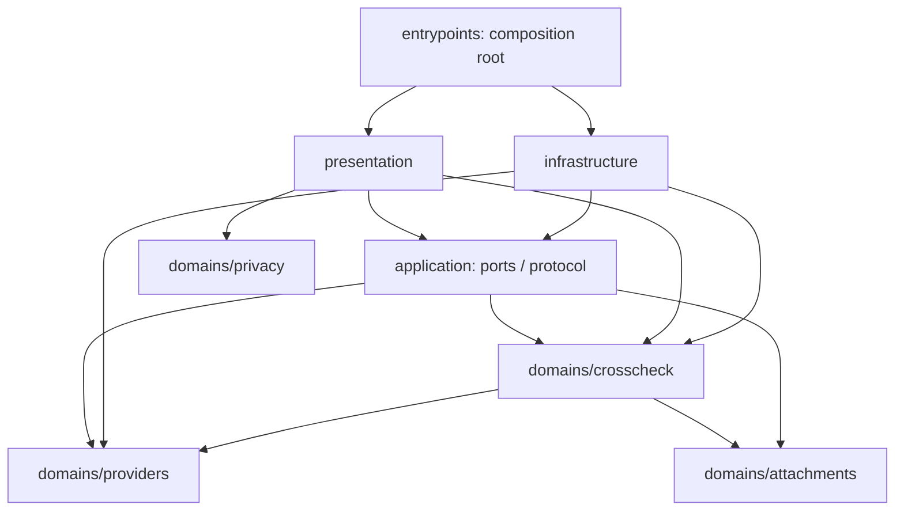

# 아키텍처

## 폴더와 책임

```text
src/
  domains/
    providers/        공급자 식별, 허용 origin, 대화 연결 참조
    attachments/      원본 파일 메타데이터·전송 크기 경계
    crosscheck/       실행/답변/근거 모델, 예산, 단계 전환, 프롬프트, 복구 규칙
    privacy/          URL/민감정보 표시 규칙
  application/        자동 파이프라인, Platform 포트, 페이지 명령·응답 스키마
  infrastructure/
    chrome/           Chrome 권한/탭/메시지/세션 저장 구현
    providers/        사이트별 DOM 선택자와 입력/완료 감지
  presentation/
    shell/            사이드패널 상태·내비게이션·디자인 토큰
    crosscheck/       답변 카드
entrypoints/          조립 지점: Platform 구현 주입, background, 페이지 bridge
tests/
  unit/{crosscheck,attachments,providers,privacy,architecture}/
  browser/            실제 Chromium에서 UI 및 built bridge 검사
  extension/          실제 MV3 설치/권한/세션 검사 (별도 머신 필요)
  fixtures/{application,providers,attachments}/  합성 응답/DOM/파일, 실계정 데이터 없음
docs/{research,architecture,security,testing,development,release}/
```

도메인 데이터는 `domains/*/model.ts`, 테스트 데이터는 `tests/fixtures`에 둡니다. 실행 중 질문·답변과 첨부 메타데이터는 Chrome `storage.session`, 첨부 원본은 열린 패널과 업로드 중인 bridge의 메모리에만 존재합니다. 다운로드와 빌드 산출물은 `.output/`, 테스트 결과는 `test-results/`에 생성하며 Git에서 제외합니다. 개인 질문·대화·토큰을 코드나 fixture로 수집하지 않습니다.



`presentation`은 Chrome 구현을 import하지 않고 주입된 `Platform`만 사용합니다. 도메인은 브라우저, React, 인프라를 모릅니다. `tests/unit/architecture/boundaries.test.ts`가 역방향 import, 순환 import, 상위 계층의 직접 `chrome.*` 호출을 검사합니다. 네이티브 UI 기능인 클립보드·다운로드·Web Locks는 화면의 책임입니다.

## 흐름과 장애 처리

1. 시작 클릭으로 선택한 origin 권한을 한 번 요청하고 각 대상 탭의 ISOLATED world에 bridge를 주입합니다. 항상 top frame만 사용합니다.
2. 메인 대화 가져오기는 페이지에 불러온 완료된 질문·답변 쌍을 순서대로 캡처하고 탭/문서 ID/정확한 URL을 고정합니다. 마지막 메인 답변은 초기 수집에서 재사용하고 이전 턴의 맥락은 모든 단계의 JSON 자료에 포함합니다. 원본의 이전 턴 수정이나 사용자의 추가 대화는 이후 메인 대화 전송을 중단합니다.
3. 도메인이 단계별 프롬프트를 만듭니다. 시작 버튼의 공유 안내에 따라 한 번 시작한 유한 파이프라인을 application 계층이 실행합니다. 각 AI 탭을 활성화하고 전송·답변 수집을 차례로 마친 뒤 다음 작업으로 이동합니다. collect → review → synthesize 사이의 추가 클릭은 없습니다. 패널은 실행 중 열린 상태로 유지해야 합니다.
4. 전송 의도를 세션에 먼저 저장합니다. 각 작업 ID는 해당 페이지에서 한 번만 시도하며 자동 재전송하지 않습니다.
5. DOM bridge는 입력 덮어쓰기/동시 생성/다중 입력란을 거부합니다. 기존 메시지 ID 집합과 새 질문·답변의 대응, 전송한 질문과의 일치·완료 표시·안정 시간을 확인합니다. 확인되지 않은 출력은 완료로 표시하지 않습니다.
6. 패널이 1초 간격으로 진행을 확인합니다. 최대 3분; bridge가 15초간 패널의 조회를 받지 못하면 중단됩니다. 이미 전송된 생성 자체를 취소하는 것은 아닙니다.
7. 패널 복원 시 `sending`을 `interrupted`로 바꿉니다. 애매한 전송을 재시도하지 않고 사용자가 사이트에서 직접 결과를 가져옵니다.
8. 최종 단계는 후보/비판/근거를 다시 종합하여 저장한 원래 메인 대화에 보냅니다. 페이지/문서가 달라지면 전송하지 않습니다. 다른 AI의 새 대화 생성에 따른 첫 URL 변경은 bridge가 감지한 결과에만 반영합니다.

첨부 원본은 사용자가 패널에서 한 번 선택합니다. 전송 경계에서 크기·인코딩·SHA-256을 검증하고, 각 AI의 업로드 입력란에 동일한 파일을 전달합니다. 완료된 첨부 상태를 확인한 뒤에만 질문을 입력·전송합니다. 파일 업로드 오류, 기존 첨부 초안, 전송 전 파일 교체는 전송을 중단합니다. 같은 탭·문서·대화에 성공적으로 전달한 기록이 있는 후속 요청에서는 다시 업로드하지 않습니다. 복원 후에는 저장된 이름·크기·내용 확인값과 일치하는 원본을 다시 선택해야 합니다.

Web Locks는 동일 확장의 패널 여러 개가 동시에 컨트롤러가 되는 것을 막습니다. service worker는 패널 열기, 세션 접근 수준 설정, Chrome이 내려받은 업데이트의 버전 안내만 담당하므로 AI 응답이나 업데이트를 기다리느라 강제로 유지하지 않습니다. 업데이트 확인·설치는 Chrome에 맡기며 패널은 수동 안내와 수동 확인 화면 진입만 제공합니다. [업데이트와 저장소 수명](../release/updates.md).

연결 상태 자동 확인과 중단 후 재개는 저장된 탭·문서·정확한 URL을 변경하지 않습니다. 대상이 달라지면 명시적으로 다시 연결해야 하며, 상태 확인만으로 다른 대화에 전송 대상을 옮기지 않습니다.

## 확장 지점

새 공급자는 provider 도메인과 DOM 어댑터, 고정 origin 권한, 합성 fixture, 실로그인 검증 기록을 함께 추가합니다. API 모드를 넣는다면 `Platform`의 전송 구현을 분리하고 별도 키 저장/권한/비용 동의 설계를 먼저 수행합니다. 웹 로그인과 API 무료 크레딧은 서로 다른 기능입니다.

모델 목록은 웹 메뉴에서 읽고 실제 선택 상태를 확인합니다. 자동 전송과 모델 메뉴 조작은 겹치지 않습니다. 메뉴 미지원은 빈 목록과 안내로 반환하며 가용 모델을 추측하지 않습니다. UI에는 연결된 탭과 입력란 확인 결과를 구별해 표시합니다.
